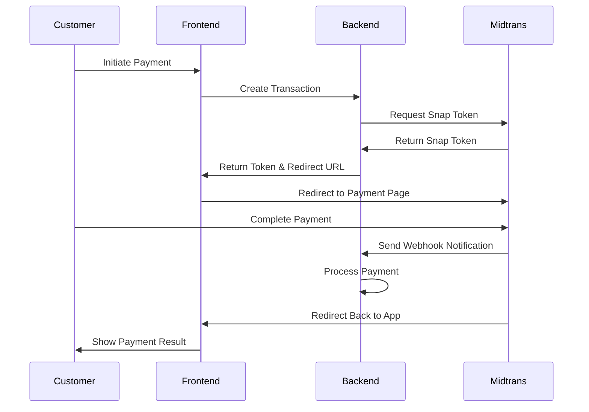

# Midtrans Integration Guide - From Zero to Production

## 📋 Table of Contents

1. [Midtrans Account Setup](#1-midtrans-account-setup)
2. [Understanding Midtrans Architecture](#2-understanding-midtrans-architecture)
3. [Environment Configuration](#3-environment-configuration)
4. [Backend Implementation](#4-backend-implementation)
5. [Frontend Integration](#5-frontend-integration)
6. [Webhook Implementation](#6-webhook-implementation)
7. [Testing & Debugging](#7-testing--debugging)
8. [Production Deployment](#8-production-deployment)
9. [Security Best Practices](#9-security-best-practices)
10. [Troubleshooting](#10-troubleshooting)

---

## 1. Midtrans Account Setup

### Step 1.1: Create Midtrans Account

1. **Visit Midtrans Website**

   - Go to [https://midtrans.com](https://midtrans.com)
   - Click "Daftar Sekarang" (Register Now)

2. **Complete Registration**

   ```
   - Business Name: Your Company Name
   - Business Type: Select appropriate type
   - Phone Number: Your business phone
   - Email: Your business email
   - Password: Strong password
   ```

3. **Verify Account**
   - Check email for verification link
   - Complete email verification
   - Submit required business documents

### Step 1.2: Get API Credentials

1. **Login to Midtrans Dashboard**

   - Go to [https://dashboard.midtrans.com](https://dashboard.midtrans.com)
   - Login with your credentials

2. **Navigate to Settings**

   - Click "Settings" in the sidebar
   - Go to "Access Keys"

3. **Copy Credentials**

   ```
   Sandbox Environment:
   - Server Key: SB-Mid-server-xxxxxxxxxx
   - Client Key: SB-Mid-client-xxxxxxxxxx

   Production Environment:
   - Server Key: Mid-server-xxxxxxxxxx
   - Client Key: Mid-client-xxxxxxxxxx
   ```

### Step 1.3: Configure Payment Methods

1. **Enable Payment Methods**

   - Go to "Settings" → "Payment Methods"
   - Enable desired payment methods:
     - Credit/Debit Cards
     - Bank Transfer
     - E-Wallets (GoPay, OVO, DANA)
     - Convenience Store
     - Cardless Credit

2. **Set Payment Settings**
   - Configure payment expiry time (default: 24 hours)
   - Set up payment notifications
   - Configure 3DS authentication

---

## 2. Understanding Midtrans Architecture

### 2.1: Payment Flow Overview



### 2.2: Key Concepts

**Snap Token**: Temporary token for payment session
**Order ID**: Unique identifier for each transaction
**Webhook**: Real-time payment status notifications
**Signature**: Security validation for webhooks

---

## 3. Environment Configuration

### Step 3.1: Install Dependencies

```bash
npm install axios crypto
```

### Step 3.2: Environment Variables

Create/update your `.env` file:

```env
# Midtrans Configuration
MIDTRANS_SERVER_KEY="SB-Mid-server-your-sandbox-key"
MIDTRANS_CLIENT_KEY="SB-Mid-client-your-sandbox-key"
MIDTRANS_IS_PRODUCTION=false

# Application URLs
FRONTEND_URL="http://localhost:3100"
BACKEND_URL="http://localhost:3000"

# Webhook Configuration
MIDTRANS_WEBHOOK_URL="http://localhost:3000/api/v1/billing/webhooks/midtrans"
```

### Step 3.3: Midtrans Dashboard Configuration

1. **Set Webhook URL**
   - Go to Settings → Configuration
   - Set Payment Notification URL: `https://yourdomain.com/api/v1/billing/webhooks/midtrans`
   - Set Finish Redirect URL: `https://yourfrontend.com/payment/success`
   - Set Error Redirect URL: `https://yourfrontend.com/payment/error`

---

## 4. Backend Implementation

### Step 4.1: Midtrans Service Implementation

```javascript
// src/services/midtrans.service.js
import axios from "axios";
import crypto from "crypto";

export class MidtransService {
  constructor() {
    this.serverKey = process.env.MIDTRANS_SERVER_KEY;
    this.clientKey = process.env.MIDTRANS_CLIENT_KEY;
    this.isProduction = process.env.MIDTRANS_IS_PRODUCTION === "true";

    // API URLs
    this.snapUrl = this.isProduction
      ? "https://app.midtrans.com/snap/v1/transactions"
      : "https://app.sandbox.midtrans.com/snap/v1/transactions";

    this.statusUrl = this.isProduction
      ? "https://api.midtrans.com/v2"
      : "https://api.sandbox.midtrans.com/v2";
  }

  /**
   * Create Snap Transaction
   */
  async createSnapTransaction(orderId, amount, customerDetails) {
    const parameter = {
      transaction_details: {
        order_id: orderId,
        gross_amount: amount,
      },
      customer_details: customerDetails,
      credit_card: {
        secure: true,
      },
      expiry: {
        start_time: this.formatMidtransDateTime(new Date()),
        unit: "hours",
        duration: 24,
      },
      callbacks: {
        finish: `${process.env.FRONTEND_URL}/payment/finish`,
        error: `${process.env.FRONTEND_URL}/payment/error`,
        pending: `${process.env.FRONTEND_URL}/payment/pending`,
      },
    };

    const authString = Buffer.from(this.serverKey + ":").toString("base64");

    try {
      const response = await axios.post(this.snapUrl, parameter, {
        headers: {
          Accept: "application/json",
          "Content-Type": "application/json",
          Authorization: `Basic ${authString}`,
        },
      });

      return response.data;
    } catch (error) {
      throw new Error(
        `Midtrans API error: ${
          error.response?.data?.error_messages || error.message
        }`
      );
    }
  }

  /**
   * Get Transaction Status
   */
  async getTransactionStatus(orderId) {
    const statusEndpoint = `${this.statusUrl}/${orderId}/status`;
    const authString = Buffer.from(this.serverKey + ":").toString("base64");

    try {
      const response = await axios.get(statusEndpoint, {
        headers: {
          Accept: "application/json",
          Authorization: `Basic ${authString}`,
        },
      });

      return response.data;
    } catch (error) {
      throw new Error(
        `Midtrans status check error: ${
          error.response?.data?.error_messages || error.message
        }`
      );
    }
  }

  /**
   * Validate Webhook Signature
   */
  validateSignature(orderId, statusCode, grossAmount, signatureKey) {
    const signatureString = `${orderId}${statusCode}${grossAmount}${this.serverKey}`;
    const expectedSignature = crypto
      .createHash("sha512")
      .update(signatureString)
      .digest("hex");

    return signatureKey === expectedSignature;
  }

  /**
   * Generate Unique Order ID
   */
  generateOrderId(userId) {
    const timestamp = Date.now();
    const random = Math.random().toString(36).substring(2, 8);
    return `TOPUP-${userId.substring(
      0,
      8
    )}-${timestamp}-${random}`.toUpperCase();
  }

  /**
   * Map Midtrans Status to Internal Status
   */
  mapTransactionStatus(midtransStatus, fraudStatus = null) {
    switch (midtransStatus) {
      case "capture":
        return fraudStatus === "accept" ? "PAID" : "PENDING";
      case "settlement":
        return "PAID";
      case "pending":
        return "PENDING";
      case "deny":
      case "cancel":
        return "CANCELLED";
      case "expire":
        return "EXPIRED";
      case "failure":
        return "FAILED";
      default:
        return "PENDING";
    }
  }

  /**
   * Format Customer Details for Midtrans
   */
  formatCustomerDetails(user) {
    return {
      first_name: user.name.split(" ")[0] || user.name,
      last_name: user.name.split(" ").slice(1).join(" ") || "",
      email: user.email,
      phone: user.phone || "",
    };
  }

  /**
   * Format date for Midtrans API (yyyy-MM-dd hh:mm:ss Z)
   */
  formatMidtransDateTime(date) {
    const year = date.getFullYear();
    const month = String(date.getMonth() + 1).padStart(2, "0");
    const day = String(date.getDate()).padStart(2, "0");
    const hours = String(date.getHours()).padStart(2, "0");
    const minutes = String(date.getMinutes()).padStart(2, "0");
    const seconds = String(date.getSeconds()).padStart(2, "0");

    // Get timezone offset in +HHMM format
    const timezoneOffset = date.getTimezoneOffset();
    const offsetHours = Math.floor(Math.abs(timezoneOffset) / 60);
    const offsetMinutes = Math.abs(timezoneOffset) % 60;
    const offsetSign = timezoneOffset <= 0 ? "+" : "-";
    const timezone = `${offsetSign}${String(offsetHours).padStart(
      2,
      "0"
    )}${String(offsetMinutes).padStart(2, "0")}`;

    return `${year}-${month}-${day} ${hours}:${minutes}:${seconds} ${timezone}`;
  }
}

export const midtransService = new MidtransService();
```

### Step 4.2: Payment Controller

```javascript
// src/controllers/payment.controller.js
import { midtransService } from "../services/midtrans.service.js";

export const createPayment = async (req, res) => {
  try {
    const { amount } = req.body;
    const user = req.user;

    // Generate unique order ID
    const orderId = midtransService.generateOrderId(user.id);

    // Format customer details
    const customerDetails = midtransService.formatCustomerDetails(user);

    // Create Midtrans transaction
    const snapResponse = await midtransService.createSnapTransaction(
      orderId,
      amount,
      customerDetails
    );

    // Save transaction to database
    const transaction = await saveTransactionToDatabase({
      orderId,
      userId: user.id,
      amount,
      snapToken: snapResponse.token,
      status: "PENDING",
    });

    res.json({
      success: true,
      data: {
        orderId,
        snapToken: snapResponse.token,
        redirectUrl: snapResponse.redirect_url,
      },
    });
  } catch (error) {
    res.status(500).json({
      success: false,
      message: error.message,
    });
  }
};
```

### Step 4.3: Webhook Handler

```javascript
// src/controllers/webhook.controller.js
export const handleMidtransWebhook = async (req, res) => {
  try {
    const notification = req.body;

    // Validate signature
    const isValidSignature = midtransService.validateSignature(
      notification.order_id,
      notification.status_code,
      notification.gross_amount,
      notification.signature_key
    );

    if (!isValidSignature) {
      return res.status(401).json({ message: "Invalid signature" });
    }

    // Process payment notification
    await processPaymentNotification(notification);

    res.status(200).json({ message: "OK" });
  } catch (error) {
    console.error("Webhook error:", error);
    res.status(500).json({ message: "Internal server error" });
  }
};

async function processPaymentNotification(notification) {
  const { order_id, transaction_status, fraud_status } = notification;

  // Get transaction from database
  const transaction = await getTransactionByOrderId(order_id);

  if (!transaction) {
    throw new Error(`Transaction not found: ${order_id}`);
  }

  // Map status
  const newStatus = midtransService.mapTransactionStatus(
    transaction_status,
    fraud_status
  );

  // Update transaction status
  await updateTransactionStatus(transaction.id, newStatus);

  // If payment successful, process business logic
  if (newStatus === "PAID") {
    await processSuccessfulPayment(transaction);
  }
}
```

---

## 5. Frontend Integration

### Step 5.1: Install Midtrans Snap

```html
<!-- Add to your HTML head -->
<script
  src="https://app.sandbox.midtrans.com/snap/snap.js"
  data-client-key="YOUR_CLIENT_KEY"
></script>
```

### Step 5.2: Payment Component (React)

```jsx
// components/PaymentButton.jsx
import { useState } from "react";

const PaymentButton = ({ amount, onSuccess, onError }) => {
  const [loading, setLoading] = useState(false);

  const handlePayment = async () => {
    setLoading(true);

    try {
      // Create payment transaction
      const response = await fetch("/api/v1/billing/topup", {
        method: "POST",
        headers: {
          "Content-Type": "application/json",
          Authorization: `Bearer ${localStorage.getItem("token")}`,
        },
        body: JSON.stringify({ amount }),
      });

      const data = await response.json();

      if (data.success) {
        // Open Midtrans Snap
        window.snap.pay(data.data.snapToken, {
          onSuccess: function (result) {
            console.log("Payment success:", result);
            onSuccess(result);
          },
          onPending: function (result) {
            console.log("Payment pending:", result);
          },
          onError: function (result) {
            console.log("Payment error:", result);
            onError(result);
          },
          onClose: function () {
            console.log("Payment popup closed");
          },
        });
      }
    } catch (error) {
      console.error("Payment error:", error);
      onError(error);
    } finally {
      setLoading(false);
    }
  };

  return (
    <button
      onClick={handlePayment}
      disabled={loading}
      className="bg-blue-500 text-white px-4 py-2 rounded"
    >
      {loading ? "Processing..." : `Pay IDR ${amount.toLocaleString()}`}
    </button>
  );
};

export default PaymentButton;
```

### Step 5.3: Payment Result Pages

```jsx
// pages/PaymentSuccess.jsx
const PaymentSuccess = () => {
  useEffect(() => {
    // Get transaction details from URL params
    const urlParams = new URLSearchParams(window.location.search);
    const orderId = urlParams.get("order_id");
    const statusCode = urlParams.get("status_code");

    // Update UI based on payment result
    if (statusCode === "200") {
      // Payment successful
      showSuccessMessage();
      redirectToDashboard();
    }
  }, []);

  return (
    <div className="payment-success">
      <h1>Payment Successful!</h1>
      <p>Your payment has been processed successfully.</p>
    </div>
  );
};
```

---

## 6. Webhook Implementation

### Step 6.1: Webhook Route

```javascript
// src/routes/webhook.routes.js
import express from "express";
import { handleMidtransWebhook } from "../controllers/webhook.controller.js";

const router = express.Router();

router.post("/midtrans", handleMidtransWebhook);

export default router;
```

### Step 6.2: Webhook Security

```javascript
// src/middleware/webhook.middleware.js
export const validateMidtransWebhook = (req, res, next) => {
  const signature = req.body.signature_key;
  const orderId = req.body.order_id;
  const statusCode = req.body.status_code;
  const grossAmount = req.body.gross_amount;

  // Validate required fields
  if (!signature || !orderId || !statusCode || !grossAmount) {
    return res.status(400).json({ message: "Missing required fields" });
  }

  // Validate signature
  const isValid = midtransService.validateSignature(
    orderId,
    statusCode,
    grossAmount,
    signature
  );

  if (!isValid) {
    return res.status(401).json({ message: "Invalid signature" });
  }

  next();
};
```

---

## 7. Testing & Debugging

### Step 7.1: Sandbox Testing

**Test Credit Cards:**

```
Visa: 4811 1111 1111 1114
Mastercard: 5211 1111 1111 1117
JCB: 3528 0000 0000 0007

CVV: 123
Expiry: Any future date
```

**Test Bank Transfer:**

```
Permata VA: Use any amount
BCA VA: Use any amount
BNI VA: Use any amount
```

### Step 7.2: Testing Webhooks Locally

1. **Use ngrok for local testing:**

```bash
# Install ngrok
npm install -g ngrok

# Expose local server
ngrok http 3000

# Use the HTTPS URL for webhook configuration
```

2. **Test webhook manually:**

```bash
curl -X POST http://localhost:3000/api/v1/billing/webhooks/midtrans \
  -H "Content-Type: application/json" \
  -d '{
    "order_id": "TEST-ORDER-123",
    "status_code": "200",
    "gross_amount": "100000.00",
    "currency": "IDR",
    "payment_type": "credit_card",
    "transaction_time": "2024-01-01 12:00:00",
    "transaction_status": "settlement",
    "fraud_status": "accept",
    "signature_key": "calculated-signature-here"
  }'
```

### Step 7.3: Debug Common Issues

```javascript
// Debug logging
console.log("Midtrans Config:", {
  serverKey: process.env.MIDTRANS_SERVER_KEY?.substring(0, 10) + "...",
  clientKey: process.env.MIDTRANS_CLIENT_KEY?.substring(0, 10) + "...",
  isProduction: process.env.MIDTRANS_IS_PRODUCTION,
  snapUrl: midtransService.snapUrl,
});

// Test API connection
const testMidtransConnection = async () => {
  try {
    const response = await midtransService.getTransactionStatus(
      "test-order-id"
    );
    console.log("Midtrans connection OK");
  } catch (error) {
    console.error("Midtrans connection failed:", error.message);
  }
};
```

---

## 8. Production Deployment

### Step 8.1: Switch to Production

1. **Update Environment Variables:**

```env
MIDTRANS_SERVER_KEY="Mid-server-your-production-key"
MIDTRANS_CLIENT_KEY="Mid-client-your-production-key"
MIDTRANS_IS_PRODUCTION=true
```

2. **Update Frontend Script:**

```html
<script
  src="https://app.midtrans.com/snap/snap.js"
  data-client-key="YOUR_PRODUCTION_CLIENT_KEY"
></script>
```

### Step 8.2: Production Checklist

- [ ] Production credentials configured
- [ ] Webhook URL updated in Midtrans dashboard
- [ ] SSL certificate installed
- [ ] Error monitoring setup
- [ ] Payment logging implemented
- [ ] Backup webhook endpoint configured

---

## 9. Security Best Practices

### 9.1: Server-Side Security

```javascript
// Always validate on server-side
const validatePayment = async (orderId) => {
  // Never trust client-side data
  const serverStatus = await midtransService.getTransactionStatus(orderId);

  // Validate against database
  const dbTransaction = await getTransactionFromDB(orderId);

  // Cross-validate amounts
  if (serverStatus.gross_amount !== dbTransaction.amount) {
    throw new Error("Amount mismatch");
  }

  return serverStatus;
};
```

### 9.2: Webhook Security

```javascript
// Always validate webhook signatures
const processWebhook = (req, res) => {
  // Validate signature first
  if (!validateSignature(req.body)) {
    return res.status(401).json({ error: "Invalid signature" });
  }

  // Process only once (idempotency)
  if (isAlreadyProcessed(req.body.order_id)) {
    return res.status(200).json({ message: "Already processed" });
  }

  // Process payment
  processPayment(req.body);
};
```

### 9.3: Data Protection

- Never log sensitive data (credit card numbers, CVV)
- Use HTTPS for all communications
- Implement rate limiting on payment endpoints
- Store minimal payment data
- Comply with PCI DSS requirements

---

## 10. Troubleshooting

### 10.1: Common Issues

**Issue: "Invalid signature" error**

```javascript
// Solution: Check signature calculation
const debugSignature = (
  orderId,
  statusCode,
  grossAmount,
  receivedSignature
) => {
  const serverKey = process.env.MIDTRANS_SERVER_KEY;
  const signatureString = `${orderId}${statusCode}${grossAmount}${serverKey}`;
  const calculatedSignature = crypto
    .createHash("sha512")
    .update(signatureString)
    .digest("hex");

  console.log("Signature Debug:", {
    signatureString,
    calculatedSignature,
    receivedSignature,
    match: calculatedSignature === receivedSignature,
  });
};
```

**Issue: Webhook not received**

- Check webhook URL in Midtrans dashboard
- Ensure server is accessible from internet
- Check firewall settings
- Verify SSL certificate

**Issue: Payment stuck in pending**

- Check transaction status via API
- Verify webhook processing
- Check for processing errors in logs

### 10.2: Monitoring & Alerts

```javascript
// Payment monitoring
const monitorPayments = async () => {
  const pendingPayments = await getPendingPayments();

  for (const payment of pendingPayments) {
    if (isExpired(payment)) {
      await markAsExpired(payment.id);
      await notifyCustomer(payment.userId, "payment_expired");
    }
  }
};

// Run every 30 minutes
setInterval(monitorPayments, 30 * 60 * 1000);
```

---

## 📞 Support & Resources

### Official Documentation

- [Midtrans Documentation](https://docs.midtrans.com/)
- [Snap Integration Guide](https://snap-docs.midtrans.com/)
- [API Reference](https://api-docs.midtrans.com/)

### Testing Tools

- [Midtrans Simulator](https://simulator.sandbox.midtrans.com/)
- [Webhook Tester](https://webhook.site/)

### Community

- [Midtrans Slack Community](https://midtrans-community.slack.com/)
- [GitHub Issues](https://github.com/Midtrans/midtrans-nodejs-client/issues)

---

This guide provides a complete implementation of Midtrans payment gateway integration from account setup to production deployment. Follow each step carefully and test thoroughly before going live.
