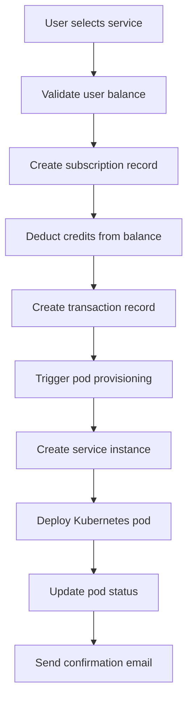
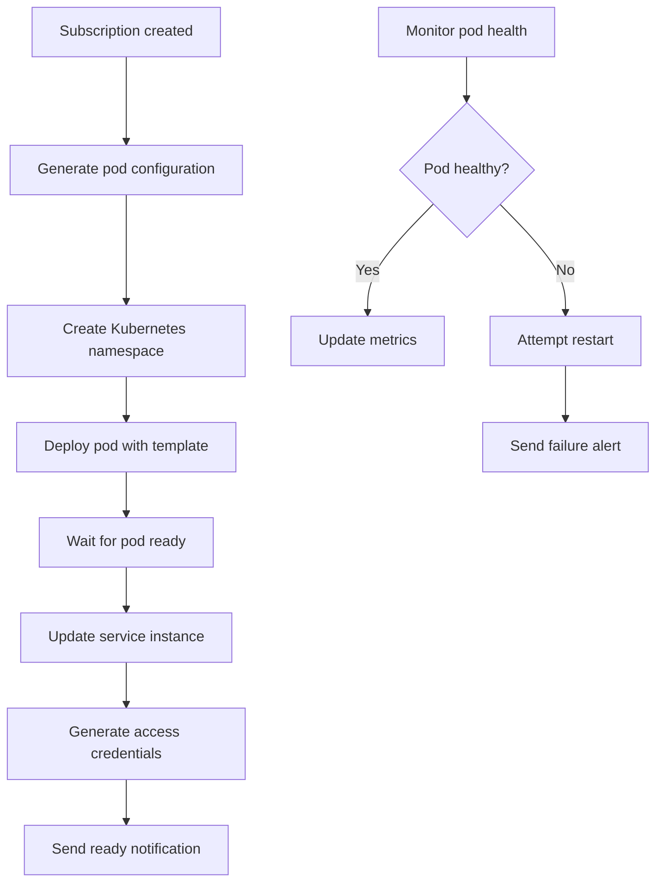

# Phase 2 Detailed Implementation Plan - PaaS Backend

## Overview

Phase 2 focuses on implementing the core business logic that connects all existing systems (authentication, billing, worker management) to deliver the actual PaaS functionality. This phase will enable customers to subscribe to services and automatically provision Kubernetes pods.

## Current State Analysis

**✅ Phase 1 Complete:**

- Express.js backend with ES6 modules
- JWT authentication system
- Admin user management
- Service catalog management
- Production-ready worker management with auto-registration
- Credit-based billing system with Midtrans integration
- Database schema with all required models
- Background job scheduler foundation

**🔄 Phase 2 Requirements:**

- Subscription lifecycle management
- Kubernetes pod provisioning
- Enhanced background job system
- Email notification system

## Database Schema Status

**✅ Already Complete:**
The current Prisma schema already includes all necessary models for Phase 2:

- [`Subscription`](prisma/schema.prisma:69) - Customer subscriptions with lifecycle management
- [`ServiceInstance`](prisma/schema.prisma:97) - Running pods with Kubernetes details
- [`UsageMetric`](prisma/schema.prisma:125) - Resource usage tracking
- [`Transaction`](prisma/schema.prisma:171) - Unified billing transactions
- All required enums and relationships

**No database changes needed** - the schema is already Phase 2 ready.

## Implementation Plan

### 1. Subscription Lifecycle Management (Week 1-2)

**Priority: HIGHEST**

#### 1.1 Subscription Service Implementation

```javascript
// src/services/subscription.service.js - ENHANCE EXISTING
-createSubscription(userId, serviceId, billingCycle) -
  validateUserBalance(userId, amount) -
  processSubscriptionPayment(subscriptionId) -
  renewSubscription(subscriptionId) -
  cancelSubscription(subscriptionId) -
  getSubscriptionsByUser(userId) -
  checkSubscriptionExpiry();
```

#### 1.2 Subscription Controller & Routes

```javascript
// src/controllers/subscription.controller.js - CREATE NEW
- POST /subscriptions - Create subscription with balance validation
- GET /subscriptions - List user subscriptions
- GET /subscriptions/:id - Get subscription details
- PUT /subscriptions/:id/renew - Renew subscription
- DELETE /subscriptions/:id - Cancel subscription
- GET /subscriptions/:id/usage - Get usage metrics
```

#### 1.3 Subscription Validation

```javascript
// src/validations/subscription.validation.js - CREATE NEW
-createSubscriptionSchema - renewSubscriptionSchema - subscriptionIdSchema;
```

#### 1.4 Integration Points

- **Billing System**: Deduct credits on subscription creation
- **Service Catalog**: Validate service availability and pricing
- **Pod Management**: Trigger pod creation on successful subscription

### 2. Kubernetes Pod Management (Week 2-3)

**Priority: HIGH**

#### 2.1 Kubernetes Client Setup

```javascript
// src/config/kubernetes.js - CREATE NEW
- Initialize @kubernetes/client-node
- Configure cluster connection
- Setup namespace management
- Error handling and retry logic
```

#### 2.2 Pod Management Service

```javascript
// src/services/pod.service.js - CREATE NEW
-createPod(subscriptionId, serviceConfig) -
  deletePod(podName, namespace) -
  getPodStatus(podName, namespace) -
  restartPod(podName, namespace) -
  getPodLogs(podName, namespace) -
  updatePodStatus(podName, status);
```

#### 2.3 Service Templates System

```javascript
// src/templates/ - CREATE NEW DIRECTORY
- n8n.template.yaml - N8N service template
- ghost.template.yaml - Ghost blog template
- wordpress.template.yaml - WordPress template
- template.parser.js - YAML template parser
```

#### 2.4 Pod Controller & Routes

```javascript
// src/controllers/pod.controller.js - ENHANCE EXISTING
- GET /pods - List user pods
- GET /pods/:id - Get pod details and status
- POST /pods/:id/restart - Restart pod
- GET /pods/:id/logs - Get pod logs
- PUT /pods/:id/status - Update pod status (internal)
```

#### 2.5 Namespace Management

```javascript
// src/services/namespace.service.js - CREATE NEW
-createCustomerNamespace(userId) -
  deleteCustomerNamespace(userId) -
  setupNamespaceQuotas(namespace, limits) -
  cleanupNamespaceResources(namespace);
```

### 3. Background Job System Enhancement (Week 3-4)

**Priority: MEDIUM**

#### 3.1 Job Queue Implementation

```bash
# Add dependencies
npm install bull redis ioredis
```

#### 3.2 Enhanced Job System

```javascript
// src/jobs/queue.manager.js - CREATE NEW
- Setup Bull queues with Redis
- Configure job retry policies
- Implement job monitoring
- Setup job failure handling

// src/jobs/subscription.jobs.js - CREATE NEW
- Daily subscription expiry checker
- Subscription renewal reminders
- Expired subscription cleanup
- Usage metrics collection

// src/jobs/pod.jobs.js - CREATE NEW
- Pod health monitoring (every 5 minutes)
- Pod status synchronization
- Resource usage collection
- Failed pod cleanup
```

#### 3.3 Job Scheduling

```javascript
// Enhance src/jobs/job-scheduler.js
- Integrate Bull queues
- Setup cron-based scheduling
- Add job monitoring dashboard
- Implement job retry logic
```

### 4. Email Notification System (Week 4)

**Priority: MEDIUM**

#### 4.1 Email Service Setup

```bash
# Add dependencies
npm install nodemailer handlebars
```

#### 4.2 Email Templates

```javascript
// src/templates/emails/ - CREATE NEW DIRECTORY
- welcome.hbs - Welcome email template
- subscription-created.hbs - Subscription confirmation
- subscription-expiring.hbs - Expiry warning
- subscription-expired.hbs - Expiry notification
- pod-ready.hbs - Pod deployment success
- pod-failed.hbs - Pod deployment failure
```

#### 4.3 Notification Service

```javascript
// src/services/notification.service.js - CREATE NEW
-sendWelcomeEmail(user) -
  sendSubscriptionConfirmation(subscription) -
  sendExpiryWarning(subscription) -
  sendPodReadyNotification(serviceInstance) -
  sendPodFailureAlert(serviceInstance);
```

## Implementation Timeline

### Week 1: Subscription Foundation

- **Days 1-2**: Enhance subscription service with credit integration
- **Days 3-4**: Implement subscription controller and routes
- **Days 5-7**: Add subscription validation and testing

### Week 2: Pod Management Setup

- **Days 1-2**: Setup Kubernetes client and configuration
- **Days 3-4**: Create service templates (N8N, Ghost, WordPress)
- **Days 5-7**: Implement basic pod creation and management

### Week 3: Integration & Jobs

- **Days 1-3**: Connect subscription → pod provisioning flow
- **Days 4-5**: Setup Bull queue system
- **Days 6-7**: Implement subscription and pod monitoring jobs

### Week 4: Notifications & Polish

- **Days 1-2**: Setup email notification system
- **Days 3-4**: Create email templates and integrate with workflows
- **Days 5-7**: Testing, bug fixes, and documentation

## API Endpoints Design

### Subscription Management

```
POST   /api/v1/subscriptions              # Create subscription
GET    /api/v1/subscriptions              # List user subscriptions
GET    /api/v1/subscriptions/:id          # Get subscription details
PUT    /api/v1/subscriptions/:id/renew    # Renew subscription
DELETE /api/v1/subscriptions/:id          # Cancel subscription
GET    /api/v1/subscriptions/:id/usage    # Get usage metrics
```

### Pod Management

```
GET    /api/v1/pods                       # List user pods
GET    /api/v1/pods/:id                   # Get pod details
POST   /api/v1/pods/:id/restart           # Restart pod
GET    /api/v1/pods/:id/logs              # Get pod logs
GET    /api/v1/pods/:id/status            # Get pod status
```

### Service Templates

```
GET    /api/v1/templates                  # List available templates
GET    /api/v1/templates/:name            # Get template details
```

## Data Flow Architecture

### Subscription Creation Flow



### Pod Lifecycle Management



## Testing Strategy

### Unit Tests

- **Services**: Test business logic in isolation
- **Controllers**: Test request/response handling
- **Utilities**: Test helper functions and validators

### Integration Tests

- **Database**: Test Prisma operations
- **Kubernetes**: Test pod operations (with mock cluster)
- **Email**: Test notification delivery
- **Jobs**: Test background job execution

### End-to-End Tests

- **Subscription Flow**: Complete user journey from signup to pod access
- **Payment Integration**: Test Midtrans webhook processing
- **Pod Lifecycle**: Test pod creation, monitoring, and cleanup

### Testing Tools

```bash
# Add testing dependencies
npm install --save-dev jest supertest @testcontainers/postgresql
```

## Configuration Requirements

### Environment Variables

```bash
# Kubernetes Configuration
KUBECONFIG_PATH="/path/to/kubeconfig"
K8S_NAMESPACE_PREFIX="customer-"
K8S_CLUSTER_DOMAIN="yourdomain.com"

# Email Configuration
SMTP_HOST="smtp.gmail.com"
SMTP_PORT=587
SMTP_USER="your-email@gmail.com"
SMTP_PASS="your-app-password"

# Job Queue Configuration
REDIS_URL="redis://localhost:6379"
BULL_DASHBOARD_PORT=3001

# Service Templates
TEMPLATE_REGISTRY="your-registry.com"
DEFAULT_RESOURCE_LIMITS='{"cpu":"1","memory":"1Gi"}'
```

### New Dependencies

```json
{
  "dependencies": {
    "@kubernetes/client-node": "^0.20.0",
    "bull": "^4.10.0",
    "ioredis": "^5.3.0",
    "nodemailer": "^6.9.0",
    "handlebars": "^4.7.0",
    "yaml": "^2.3.0"
  },
  "devDependencies": {
    "@testcontainers/postgresql": "^10.0.0"
  }
}
```

## Deployment Considerations

### Production Requirements

- **Redis Cluster**: For job queue reliability
- **Kubernetes Access**: Service account with pod management permissions
- **Email Service**: SMTP server or service (SendGrid, AWS SES)
- **Monitoring**: Prometheus metrics for job queues and pod status

### Security Considerations

- **Kubernetes RBAC**: Limit pod management permissions
- **Namespace Isolation**: Ensure customer pod isolation
- **Email Security**: Secure SMTP credentials
- **Job Queue Security**: Redis authentication and encryption

## Success Metrics

### Technical Metrics

- **Pod Provisioning Time**: < 5 minutes from subscription to ready
- **API Response Time**: < 200ms for subscription operations
- **Job Processing**: < 30 seconds for background jobs
- **System Uptime**: > 99.5% availability

### Business Metrics

- **Subscription Success Rate**: > 95% successful subscriptions
- **Pod Health**: > 99% pod uptime
- **Customer Satisfaction**: < 2 hours support response time

## File Structure After Phase 2

```
src/
├── server.js                           # ✅ Main Express server
├── config/
│   ├── database.js                     # ✅ Prisma configuration
│   └── kubernetes.js                   # 🆕 Kubernetes client setup
├── controllers/
│   ├── auth.controller.js              # ✅ Authentication handlers
│   ├── user.controller.js              # ✅ User management handlers
│   ├── service.controller.js           # ✅ Service catalog handlers
│   ├── worker.controller.js            # ✅ Worker node handlers
│   ├── billing.controller.js           # ✅ Billing handlers
│   ├── subscription.controller.js      # 🆕 Subscription management
│   └── pod.controller.js               # 🆕 Pod management handlers
├── services/
│   ├── auth.service.js                 # ✅ Authentication logic
│   ├── user.service.js                 # ✅ User management logic
│   ├── service.service.js              # ✅ Service catalog logic
│   ├── worker.service.js               # ✅ Worker management logic
│   ├── billing.service.js              # ✅ Billing logic
│   ├── midtrans.service.js             # ✅ Payment gateway
│   ├── subscription.service.js         # 🔄 Enhanced subscription logic
│   ├── pod.service.js                  # 🆕 Pod management logic
│   ├── namespace.service.js            # 🆕 Namespace management
│   └── notification.service.js         # 🆕 Email notifications
├── jobs/
│   ├── job-scheduler.js                # ✅ Basic job scheduler
│   ├── health-monitor.job.js           # ✅ Worker health monitoring
│   ├── billing.jobs.js                 # ✅ Billing automation
│   ├── queue.manager.js                # 🆕 Bull queue management
│   ├── subscription.jobs.js            # 🆕 Subscription monitoring
│   └── pod.jobs.js                     # 🆕 Pod health monitoring
├── templates/
│   ├── emails/                         # 🆕 Email templates directory
│   │   ├── welcome.hbs
│   │   ├── subscription-created.hbs
│   │   ├── subscription-expiring.hbs
│   │   └── pod-ready.hbs
│   ├── n8n.template.yaml               # 🆕 N8N service template
│   ├── ghost.template.yaml             # 🆕 Ghost service template
│   ├── wordpress.template.yaml         # 🆕 WordPress service template
│   └── template.parser.js              # 🆕 Template parser utility
└── validations/
    ├── auth.validation.js              # ✅ Auth validation schemas
    ├── user.validation.js              # ✅ User validation schemas
    ├── service.validation.js           # ✅ Service validation schemas
    ├── worker.validation.js            # ✅ Worker validation schemas
    ├── billing.validation.js           # ✅ Billing validation schemas
    ├── subscription.validation.js      # 🆕 Subscription validation
    └── pod.validation.js               # 🆕 Pod validation schemas
```

## Phase 2 Success Criteria

### Functional Requirements

- ✅ Users can create subscriptions with automatic credit deduction
- ✅ Kubernetes pods are automatically provisioned upon subscription
- ✅ Pod health monitoring and automatic restart capabilities
- ✅ Email notifications for subscription and pod events
- ✅ Background jobs for system maintenance and monitoring

### Technical Requirements

- ✅ Kubernetes integration with proper namespace isolation
- ✅ Robust job queue system with Redis
- ✅ Email notification system with templates
- ✅ Comprehensive API endpoints for subscription and pod management
- ✅ Complete test coverage for new functionality

### Performance Requirements

- ✅ Pod provisioning within 5 minutes
- ✅ API response times under 200ms
- ✅ Background job processing under 30 seconds
- ✅ System uptime above 99.5%

This detailed plan provides a comprehensive roadmap for implementing Phase 2 of the PaaS backend system, building upon the solid foundation established in Phase 1.
