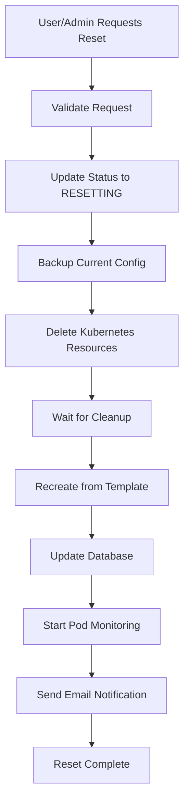

# Reset Pod Feature Documentation

## Overview

The Reset Pod feature allows both users and administrators to completely reset a pod when it becomes broken or corrupted. Unlike a restart, which preserves the current configuration and data, a reset completely destroys the pod and recreates it from scratch using the original service template.

## Key Differences: Reset vs Restart

| Operation   | Purpose             | Data Preservation        | Configuration               | Use Case                     |
| ----------- | ------------------- | ------------------------ | --------------------------- | ---------------------------- |
| **Restart** | Restart current pod | ✅ Preserves all data    | ✅ Keeps current config     | Normal restart needs         |
| **Reset**   | Fresh start         | ❌ **Destroys all data** | ❌ **Clears custom config** | When pod is broken/corrupted |

## Features

### User Features

- **Self-Service Reset**: Users can reset their own subscription pods
- **Self-Service Restart**: Users can restart their own subscription pods
- **Email Notifications**: Users receive email notifications when their pod is reset
- **Access Control**: Users can only manage their own subscription pods

### Admin Features

- **Universal Access**: Admins can reset any user's pod
- **Multiple Endpoints**: Direct reset endpoint and action-based endpoint
- **Comprehensive Logging**: All admin actions are logged with user details
- **User Notification**: Pod owners are automatically notified when admins reset their pods

## API Endpoints

### User Endpoints

#### Reset Subscription Pod

```http
POST /api/v1/subscriptions/:id/reset-pod
Authorization: Bearer <user_token>
```

**Description**: Completely resets the user's own subscription pod.

**Response**:

```json
{
  "success": true,
  "data": {
    "id": "service_instance_id",
    "podName": "new-pod-name",
    "namespace": "customer-namespace",
    "status": "PENDING",
    "message": "Your service has been reset successfully. It will be available shortly with fresh configuration.",
    "resetAt": "2025-01-26T09:00:00.000Z",
    "resetCount": 2,
    "subscription": {
      "id": "subscription_id",
      "status": "ACTIVE",
      "service": {...}
    }
  }
}
```

#### Restart Subscription Pod

```http
POST /api/v1/subscriptions/:id/restart-pod
Authorization: Bearer <user_token>
```

**Description**: Restarts the user's own subscription pod with current configuration.

### Admin Endpoints

#### Reset Any Pod (Direct)

```http
POST /api/v1/admin/pods/:id/reset
Authorization: Bearer <admin_token>
```

**Description**: Admin can reset any user's pod directly.

#### Reset Any Pod (Action)

```http
POST /api/v1/admin/pods/:id/action
Authorization: Bearer <admin_token>
Content-Type: application/json

{
  "action": "reset"
}
```

**Description**: Admin can reset any user's pod using the action endpoint.

**Available Actions**: `restart`, `stop`, `start`, `reset`, `delete`

## Implementation Details

### Database Schema Changes

#### ServiceInstance Model Updates

```prisma
model ServiceInstance {
  // ... existing fields

  // Reset functionality fields
  resetCount    Int      @default(0)     // Number of times pod has been reset
  lastResetAt   DateTime?               // Last reset timestamp
  resetBackup   String?                 // JSON backup of configuration before reset
  customConfig  Json?                   // Custom user configuration
  deploymentConfig Json?               // Deployment configuration
  resourceLimits Json?                 // Resource limits configuration
  lastError     String?                // Last error message
}
```

#### PodStatus Enum Update

```prisma
enum PodStatus {
  PENDING
  RUNNING
  FAILED
  SUCCEEDED
  UNKNOWN
  RESTARTING
  STOPPED
  RESETTING  // NEW STATUS
}
```

### Service Layer Architecture

#### Core Reset Function

```javascript
// src/services/pod.service.js
export const resetPod = async (serviceInstanceId) => {
  // 1. Backup current configuration
  // 2. Update status to RESETTING
  // 3. Delete all Kubernetes resources
  // 4. Wait for cleanup completion
  // 5. Recreate from original service template
  // 6. Update database with fresh configuration
  // 7. Start monitoring new pod
  // 8. Send notification to user
};
```

#### User Reset Function

```javascript
// src/services/pod.service.js
export const userResetPod = async (subscriptionId, userId) => {
  // 1. Verify subscription ownership
  // 2. Check subscription and pod state
  // 3. Call core reset function
  // 4. Return user-friendly response
};
```

#### Admin Reset Function

```javascript
// src/services/pod.service.js
export const adminResetPod = async (serviceInstanceId) => {
  // 1. Get pod details with owner info
  // 2. Call core reset function
  // 3. Return admin response with owner details
};
```

### Reset Process Flow



### Email Notifications

#### Reset Notification Template

- **Subject**: `🔄 Service Reset Complete - {Service Name}`
- **Content**: Explains that the service was reset, data was cleared, and service will be available shortly
- **Includes**: Reset reason, reset count, service URL, dashboard link

#### Notification Triggers

- **User Reset**: User receives notification about their own reset
- **Admin Reset**: User receives notification that admin reset their pod

### Error Handling

#### User Reset Errors

- `Subscription not found`
- `Access denied - not your subscription`
- `No active service instance found`
- `Subscription must be active or expired to reset pod`
- `Pod cannot be reset in current state: {status}`
- `Service temporarily unavailable`

#### Admin Reset Errors

- `Pod not found`
- `Kubernetes service temporarily unavailable`

### Security Considerations

#### Access Control

- **Users**: Can only reset their own subscription pods
- **Admins**: Can reset any user's pod
- **Authentication**: JWT token required for all endpoints
- **Authorization**: Role-based access control enforced

#### Audit Logging

- All reset operations are logged with user/admin details
- Reset count is tracked in database
- Backup configuration is stored for potential recovery

## Testing

### User Testing Scenarios

#### Test 1: User Reset Own Pod

```http
# 1. Get subscription ID
GET /api/v1/subscriptions

# 2. Reset the pod
POST /api/v1/subscriptions/{id}/reset-pod

# 3. Verify status change
GET /api/v1/subscriptions
```

#### Test 2: User Restart Own Pod

```http
# 1. Restart the pod
POST /api/v1/subscriptions/{id}/restart-pod

# 2. Verify status change
GET /api/v1/subscriptions
```

### Admin Testing Scenarios

#### Test 1: Admin Reset Any Pod (Direct)

```http
# 1. Get pod ID
GET /api/v1/admin/pods

# 2. Reset the pod
POST /api/v1/admin/pods/{id}/reset

# 3. Verify status change
GET /api/v1/admin/pods/{id}
```

#### Test 2: Admin Reset Any Pod (Action)

```http
# 1. Reset using action endpoint
POST /api/v1/admin/pods/{id}/action
{
  "action": "reset"
}

# 2. Verify status change
GET /api/v1/admin/pods
```

### Error Testing Scenarios

#### Test Invalid Requests

```http
# Test non-existent subscription
POST /api/v1/subscriptions/invalid-id/reset-pod

# Test other user's subscription
POST /api/v1/subscriptions/other-user-id/reset-pod

# Test invalid action
POST /api/v1/admin/pods/{id}/action
{
  "action": "invalid_action"
}
```

## Monitoring and Observability

### Metrics to Track

- **Reset Count**: Number of resets per pod/user
- **Reset Success Rate**: Percentage of successful resets
- **Reset Duration**: Time taken for complete reset process
- **Error Rate**: Failed reset attempts

### Logging

- **Info Level**: Successful reset operations
- **Warn Level**: Partial failures during reset
- **Error Level**: Complete reset failures

### Alerts

- **High Reset Rate**: Alert if reset rate exceeds threshold
- **Reset Failures**: Alert on consecutive reset failures
- **Long Reset Duration**: Alert if reset takes too long

## Production Deployment

### Database Migration

```bash
# Apply Prisma schema changes
npx prisma migrate dev --name add-reset-functionality
npx prisma generate
```

### Environment Variables

No new environment variables required. Uses existing Kubernetes and notification configurations.

### Rollback Plan

If issues occur, the reset functionality can be disabled by:

1. Removing the new routes from route files
2. The existing restart functionality remains unchanged
3. Database schema changes are additive and don't break existing functionality

## Best Practices

### When to Use Reset vs Restart

#### Use Reset When:

- Pod is completely broken or corrupted
- Service is stuck in an unrecoverable state
- User has misconfigured the service beyond repair
- Data corruption is suspected
- Fresh start is needed

#### Use Restart When:

- Service is temporarily unresponsive
- Configuration changes need to be applied
- Normal maintenance restart
- Memory leaks or performance issues

### User Communication

- Always inform users that reset will destroy all data
- Provide clear instructions about the reset process
- Set expectations about downtime (2-5 minutes)
- Offer restart as an alternative for less severe issues

### Admin Guidelines

- Use reset sparingly and only when necessary
- Always inform users when resetting their pods
- Document the reason for admin-initiated resets
- Consider restart first before reset

## Future Enhancements

### Potential Improvements

1. **Backup Before Reset**: Automatic backup of user data before reset
2. **Selective Reset**: Reset only specific components (database, config, etc.)
3. **Reset Scheduling**: Schedule resets during maintenance windows
4. **Reset Templates**: Different reset templates for different scenarios
5. **Rollback Capability**: Ability to rollback to previous state after reset

### Integration Opportunities

1. **Monitoring Integration**: Automatic reset triggers based on health metrics
2. **Backup Integration**: Integration with backup systems for data preservation
3. **CI/CD Integration**: Reset as part of deployment pipelines
4. **Alerting Integration**: Enhanced alerting for reset operations

## Conclusion

The Reset Pod feature provides a powerful tool for both users and administrators to recover from pod failures and corruption. By completely recreating pods from scratch, it ensures a clean state while maintaining proper access controls, notifications, and audit trails.

The feature is designed to be safe, well-documented, and easy to use, with clear distinctions between reset and restart operations. Comprehensive testing scenarios and error handling ensure reliable operation in production environments.
